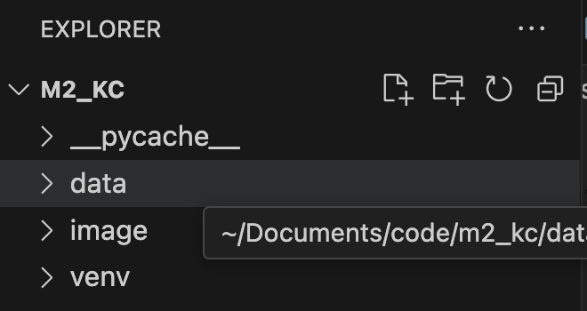

## Congratulations on your progress in the Code:You program!

This knowledge check is designed to assess your skills in working with pandas. You'll be presented with 9 questions that focus on analyzing and performing light data cleaning tasks. It's a great opportunity to apply what you've learned and solidify your understanding of data manipulation using pandas.

### Running the Project

To complete this assignment, you'll be working exclusively with the `Student_KC.ipynb` notebook. The necessary API calls will be executed within the notebook to generate your data.

To successfully complete the assignment, follow these steps:

1. Fork the Repository
    - Fork this repository to create a copy on your GitHub account.

1. Create a Virtual Environment
    - Follow the steps provided below to set up a virtual environment.

1. Insert a Screenshot
    - Take a screenshot of your virtual environment from the Explorer window.

    - ### Shortcut keys for taking a screenshot:

    - Windows: Win + Shift + S (then select the area to capture)
    - Mac: Cmd + Shift + 4 (then select the area to capture)
    - example 

1. Complete All Questions
    - Work through and complete all the questions in the notebook.

1. Push the Finished Repository to GitHub
    - After completing the assignment, push your changes to your GitHub repository.

1. Submit the Assignment
    - Attach a link to your GitHub repository in the Google Classroom assignment.

--- 
## Insert the screenshot below:
  - Your screenshot of the virtual environment here:
